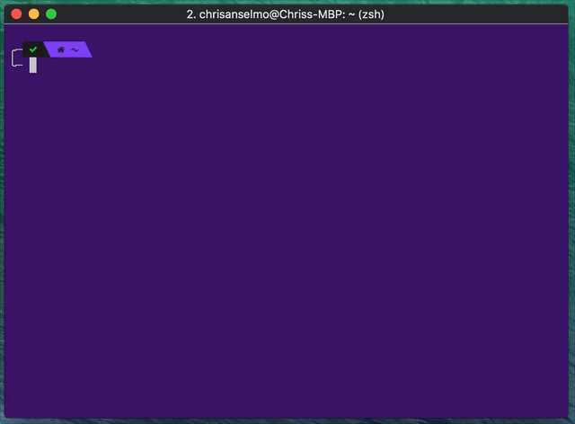

<h1 align="center">site-scan</h1>
<p align="center">
  
</p>
<p align="center">CLI for capturing website screenshots, powered by <a href="https://github.com/GoogleChrome/puppeteer">puppeteer</a>.</p>

# Installation

To install globally:
```
$ npm install site-scan -g
```

# Usage

You can use `sitescan` or just `ss`:
```
$ sitescan [options] [url(s)]
$ ss [options] [url(s)]
```

# Options
`-h` or `--help` Display help

`-p` or `--path` Path to save screenshots to (Defaults to CWD)

`-x` or `--width` Custom viewport width (Default: 1920)

`-y` or `--height` Custom viewport height (Default 1080)

`-f` or `--full` Capture full page screenshot (Default: false)

`-t` or `--transparent` Hides default background to allow transparency (Default: false)

`-j` or `--jpeg` Capture JPEG screenshot (Default: PNG)

`-q` or `--quality` Quality of JPEG screenshot (0-100, Default: 100)

`-s` or `--sleep` Time (ms) to wait after load before screenshot (Default: 0)

`-n` or `--name` Custom file name. Multiple screenshots will append a number to this name. (Default: website hostname)

`-r` or `--scale` Custom browser scaling to use (Default: 1)

`-l` or `--list` Loads url(s) from a local file instead of the CLI (must be separated by a space character) (Default: undefined)

# Examples

Take a full page screenshot of a website
```
$ ss youtube.com --full
```

Take a screenshot of multiple websites as JPEGs
```
$ ss youtube.com google.com -j
```

Use a custom resolution
```
$ ss github.com -x 640 -y 480
```

Use a text file of space-separated URLs to load from
```
$ ss -l ./path/to/websites_list.txt
```

# Development
```
$ git clone https://github.com/christopherwk210/site-scan
$ cd site-scan
$ npm i
$ node ./lib/site-scan.js
```
